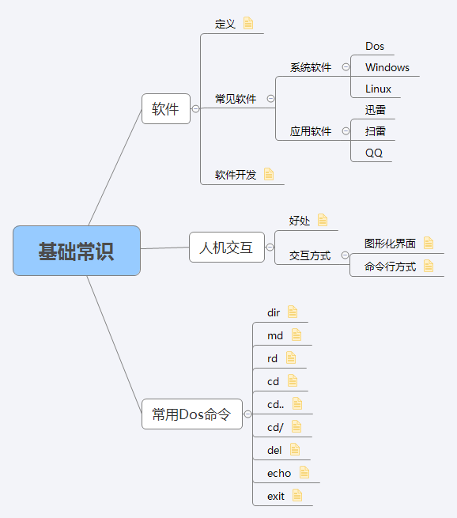

# 基础常识
# 软件
## 定义
一系列按照特定顺序组织的计算机数据和指令的集合。
##  常见软件
### 系统软件
- Dos
- Windows
- Linux

### 应用软件
- 迅雷
- 扫雷
- QQ

## 人机交互
### 好处
软件的出现，实现了人与计算机更好的交互。
### 人机交互方式
- 图像化界面
- 命令行方式

## 常见Dos命令
- dir
- md
- rd
- cd 
- cd..
- cd/
- del
- echo
- exit

# 思维导图
