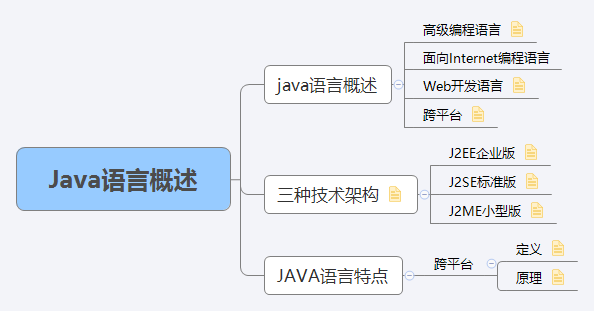

# Java 语言概述
# Java语言概述
## 高级编程语言 
是SUN(Stanford University Network，斯坦福大学网络公司)1995年推出的一门高级编程语言  
## 面向Internet编程语言
java是一种面向Internet的编程语言 
## Web开发语言
随着java技术在web方面的不断成熟，已经成为WEb应用的首选开发语言
## 跨平台
简单易学，完全面向对象，安全可靠与平台无关的编程语言
# java语言的 三种技术架构
## J2EE企业版
J2EE(java 2 Platform Enterprise Edition) 企业版  
是为开发企业环境下的应用程序提供的一套解决方式。  
该技术系统中包含的技术如Servlet Jsp等，主要针对于Web应用程序开发。  
## J2SE标准版
J2SE(java 2 platform standard edition) 标准版
是为开发普通桌面和商务应用程序提供的解决方案。  
该技术体系是其他两者的基础，可以完成一些桌面应用程序的开发。比如java版的扫雷。
## J2ME小型版
J2ME(java 2 platform micro edition) 小型版
该版本是为开发电子消费产品和嵌入式设备提供的解决方案。  
该技术体系主要应用于小型电子消费类产品，如手机中的应用程序等。  

# java语言的特点
## 跨平台

# 思维导图

