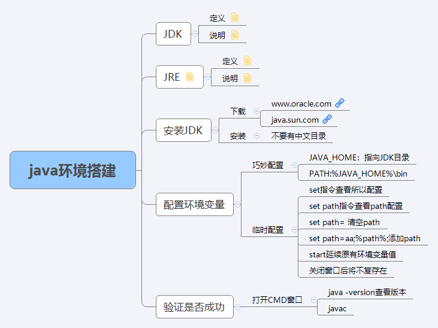

# java环境搭建
## JRE
- 定义：java runtime environment java运行环境
- 说明：包含了java虚拟机(jvm java virtual machine)和java程序所需的核心类库等。如果想要运行一个开发好的java程序，计算机中只需要安装JRE即可。

## JDK
- 定义：java development kit java开发工具包
- 说明：JDK是提供给java开发人员使用的，其中包含了java的开发工具，也包含了JRE.所以，安装了JDK，就不用再单独安装JRE了。

## 安装JDK
### 下载
- www.oracle.com
- java.sun.com

## 配置环境变量
### 巧妙配置
- JAVA_HOME：指向JDK目录
- PATH:%JAVA_HOME%\bin

### 临时配置
- set指令查看所以配置
- set path指令查看path配置
- set path= 清空path
- set path=aa;%path%;添加path
- start延续原有环境变量值
- 关闭窗口后将不复存在

## 验证是否成功
- java -version查看版本
- 输入javac回车

# 思维导图
