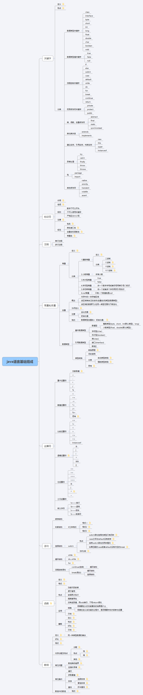

# Java语言基础组成
## 关键字
### 定义
被java语言赋予了特殊含义的单词
### 特点
关键字中所有字母都为小写
### 分类
#### 数据类型关键字
- class
- interface
- byte
- short
- int
- long
- float
- double
- char
- boolean
- void

#### 数据类型值关键字
- true
- false
- null

#### 流程控制关键字
- if
- else
- switch
- case
- default
- while
- do
- for
- break
- continue
- return

#### 权限修饰符关键字
- private
- protect
- public

#### 类、函数、变量修饰符
- abstract
- final
- static
- synchronized

#### 类与类关系
- extends
- implements

#### 建立实例、引用实例、判断实例
- new
- this
- super
- instanceof

#### 异常处理
- try
- catch
- finally
- throw
- throws

#### 包
- package
- import

#### 其他
- native
- strictfp
- transient
- volatile
- assert

## 标识符
### 作用
在程序中自定义的一些名称
### 组成
由26个英文字母大小写，数字：0-9 符号：_$组成
### 规则
- 数字不可以开头
- 不可以使用关键字
- 严格区分大小写

### 注意
在起名字时，为了提高阅读性，尽量有意义
### 规范
- 包名：多单词组成时所有字母都小写xxxyyyzzz
- 类名接口名：多单词组成时，第一个单词首字母大写XxxYyyZz
- 变量名和函数名：多单词组成时，第一个单词首字母小写，第二个单词开始每个单词首字母大写。 xxxYyyZzz
- 常量名：所有字母都大写。多个单词时每个单词用下划线链接。XXX_YYY_ZZZ

## 注释
- 单行注释
- 多行注释

## 常量和变量
### 常量
#### 定义
常量表示不能改变的数值
#### 分类
##### 1.整数常量
- 二进制
- 八进制
- 十进制
- 十六进制

##### 2.小数常量
##### 3.布尔型常量
- true
- false

##### 4.字符型常量
##### 5.字符串常量
##### 6.null常量

### 变量
#### 概念
- 内存中的一块存储区域
- 该区域有自己的名称(变量名)和类型(数据类型)
- 该区域的数据可以在同一类型范围内不断变化

#### 为何定义
用来不断的存放同一类型的常量，并可以重复使用
#### 格式
数据类型变量名=  初始化值；

### 数据类型
#### 基本数据类型
- 数值型
- 字符型(char)
- 布尔型(boolean)

#### 引用类型
- 类(class)
- 接口(interface)
- 数组[]

#### 类型转换

## 运算符
- 算术运算符
- 赋值运算符
- 比较运算符
- 逻辑运算符
- 位运算符
- 三元运算符
- 转义字符

## 语句
### 顺序结构
### 判断结构
3种格式
### 选择结构
### 循环结构
### 流程控制语句
- continue
- break

## 函数
### 定义
函数就是定义在类中的具有特定功能的独立小程序，函数也称为方法；
### 格式
修饰符返回值类型函数名(参数类型形式参数1，参数类型形式参数2，)
{
	执行语句;
	return 返回值

}

a.返回值类型：函数运行后的结果的数据类型。  
b.参数类型：是形式参数的数据类型。  
c.形式参数：是一个变量，用于存储调用函数时传递给函数的实际参数  
d.实际参数：传递给形式参数的具体数值。  
e.return：用于结束函数  
f.返回值：该值会返回给调用者  
### 特点
- 功能代码封装
- 便于复用
- 被调用才执行
- 提高复用性
- 没有返回值，用void表示，不写return语句

### 应用
#### 明确
- 明确要定义的功能最后的结果是什么
- 明确在定义该功能的过程中，是否需要未知内容参与运算

#### 重载

## 数组
### 内存分配及特点
### 常见问题
### 常见操作
### 数组中的数组
# 思维导图

